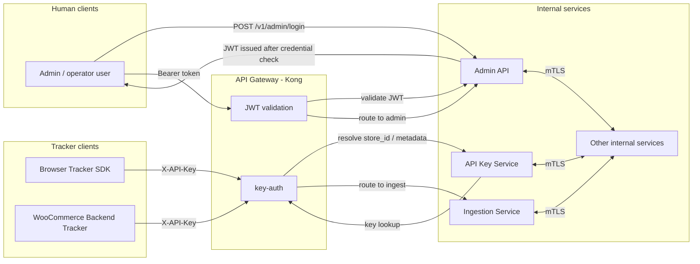

# Security

Cross-cutting identity, authorization, transport, and compliance rules.

## Authentication model

- Tracker ingestion uses API keys at the edge.
- Human/admin access uses Kong-issued JWTs through Kong.
- Kong enforces edge auth and forwards trusted identity context to upstream services.
- Internal service-to-service communication uses mTLS.
- Browser tracker and WooCommerce backend tracker roles are described in [tracking-model.md](tracking-model.md).

## Decisions

- Use Kong as the identity enforcement point for tracker and admin traffic.
- Let the Admin API verify admin credentials and issue JWTs.
- Keep tracker ingestion on API keys only.
- Keep the API Key Service minimal and cache-backed.
- Avoid external identity providers in the baseline architecture.
- Use a separate tracking model document for browser and WooCommerce event-source trust boundaries.

## Transport security

- Internal services use mTLS.
- External and internal HTTP/gRPC should use TLS.
- Kafka uses TLS with SASL/SCRAM.

## Network security

- All services run in a private VPC. The API Gateway is the only public endpoint.
- Kubernetes network policies restrict ingress to the API Gateway only.

## Data encryption

- At rest: EBS, RDS, and S3 are encrypted with AES-256.
- In transit: TLS for all external and internal HTTP/gRPC; Kafka TLS with SASL/SCRAM.

## Compliance

- Respect `email_consent` and `sms_consent` flags before sending notifications.
- Keep PII (email, phone) stored only in PostgreSQL, not in ClickHouse.
- Support right-to-deletion: delete customer record and anonymize ClickHouse events by setting `customer_email = NULL`.

## Notes

- Admin services should not trust client headers directly.
- Identity should be resolved at the gateway, then re-checked in the service when tenant boundaries matter.
