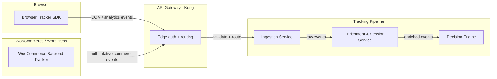

# Tracking Model

This document is the canonical source for tracker behavior, event scope, and trust boundaries. It replaces the earlier split tracker pages.

## Two tracker sources

### Browser tracker SDK

Implementation lives in `packages/web`. See [wince/docs/WEB.md](../../wince/docs/WEB.md) for the full SDK specification.

**Runtime behaviour:**
- Runs entirely in the customer browser.
- Two entry points: `init(config)` (main-thread only) and `initWithWorker(config)` (offloads enrichment/persistence to a Web Worker with IndexedDB).
- Queues events in IndexedDB when offline; retries on network recovery.
- Maintains a WebSocket connection to `wss://gateway/ws?session_id=...&api_key=...` for intervention delivery. Reconnects with exponential backoff, capped at 30 s.
- Batches up to 10 events per flush or flushes every 5 s, whichever comes first.
- Flushes via `navigator.sendBeacon` on page unload (critical lane first, then high, then normal).
- Target bundle size under 15 KB gzipped.

**Identity fields:**
- `sid` — per-tab session ID (UUID v4, sessionStorage).
- `anon` — persistent anonymous device ID (UUID v4, localStorage).
- `uid` — set after `identify()` call.
- `window_id` — tab-scoped ID, distinct from session ID.

#### Event schema

Every event sent to the backend is a `TrackEvent` object:

| Field | Required | Description |
| --- | --- | --- |
| `eid` | Yes | UUID v7 event ID (dedupe key) |
| `seq` | Yes | Per-session monotonic sequence number |
| `t` | Yes | Event name (e.g. `$page_view`, `$cart_add`) |
| `ts` | Yes | Client capture timestamp (ms) |
| `sid` | Yes | Session ID |
| `anon` | Yes | Anonymous device ID |
| `uid` | No | Identified user ID (post-`identify`) |
| `props` | No | Event-specific properties (see catalogue below) |
| `$set` | No | Person traits to merge |
| `$set_once` | No | Person traits written only if absent |
| `url` | No | Document URL at capture time |
| `ref` | No | Document referrer at capture time |
| `window_id` | No | Tab-scoped window ID |
| `pageview_id` | No | Current page view ID |
| `offset` | Transport | `sent_at - ts`; added at encode time |
| `schema_v` | Transport | Fixed at `1`; added at encode time |

#### Transport body format

```json
{
  "sent_at": 1730000000000,
  "events": [
    {
      "eid": "...",
      "seq": 12,
      "t": "$page_view",
      "ts": 1729999999000,
      "sid": "...",
      "anon": "...",
      "props": { "title": "Cart", "device_type": "mobile" },
      "offset": 1000,
      "schema_v": 1
    }
  ]
}
```

- When compression is enabled the JSON body is gzip-encoded and `Content-Encoding: gzip` is added.
- `keepalive` is set for request bodies under 51 KiB.
- Retries honour transient failures and `Retry-After`.

#### Event catalogue

All event names carry a `$` prefix and a `$plugin_source` field in `props` identifying the emitting plugin. The backend should treat `props` as plugin-specific; only the envelope fields are fixed.

**Page navigation — `$plugin_source: 'pageView'`**

| Event | Trigger | Key `props` fields |
| --- | --- | --- |
| `$page_view` | Page load, SPA `popstate`/`hashchange` | `title`, `ref`, `navigation_type`, `device_type`, `screen_width_px`, `screen_height_px`, `utm_*`, `referrer_type`, `$session_resume` |
| `$page_leave` | `pagehide` drain | `time_on_page_ms`, `visible_time_ms`, `scroll_depth_pct`, `max_scroll_depth_pct`, `scroll_px`, `resize_count`, `viewport_width_px`, `session_duration_ms` |
| `$scroll_depth` | 25 / 50 / 75 / 100% scroll milestones | `depth_pct` |

On SPA navigations `$page_view` also includes `$prev_scroll_depth_pct`, `$prev_time_on_page_ms`, and other `$prev_*` metrics from the previous page.

**Click and interaction — `$plugin_source: 'click'` / `'rageClick'` / `'deadClick'` / `'exitIntent'` / `'copyPaste'` / `'textSelection'` / `'backtrack'`**

| Event | Trigger | Key `props` fields |
| --- | --- | --- |
| `$click` | User click | `tag`, `text`, `elements_chain`, `href`, `track_id`, `label`, `hesitation_ms`, `has_modifier`, `data-track-*` attrs |
| `$rage_click` | 3+ clicks on same element within 1 s | `tag`, `text`, `elements_chain`, `count`, `first_at`, `href`, `track_id` |
| `$dead_click` | Click with no DOM change within 200 ms | `tag`, `text`, `href`, `track_id`, `elements_chain`, `elapsed_ms`, `has_modifier` |
| `$exit_intent` | Mouse leaves viewport from top edge | `page` (pathname) |
| `$copy` / `$cut` | Copy or cut action | `tag`, `text`, `href` |
| `$text_selection` | Text selection | `selected_length`, `context_element_tag`, `context_track_id` |
| `$backtrack` | User navigates back in same session | `from_path`, `to_path` |

**Cart and commerce — `$plugin_source: 'cart'`**

Events are fired via `CustomEvent('wince:cart', { detail: { action, ...fields } })`. The plugin maps `action` to event name `$cart_{action}`.

| Event | Trigger | Key `props` fields |
| --- | --- | --- |
| `$cart_add` | Item added | `product_id`, `name`, `variant_id`, `quantity`, `price`, `currency`, `cart_value_total`, `item_count`, `category`, `stock_status` |
| `$cart_remove` | Item removed | `product_id`, `quantity`, `cart_value_total`, `item_count` |
| `$cart_update` | Quantity or option changed | `product_id`, `quantity`, `cart_value_total` |
| `$cart_view_cart` | Cart page / cart drawer opened | `cart_value_total`, `item_count` |
| `$cart_product_view` | Product detail page | `product_id`, `price`, `category`, `stock_status` |
| `$cart_checkout_start` | Checkout flow entered | `cart_value_total`, `item_count` |
| `$cart_checkout_step` | Checkout step reached | `step`, `step_name`, `time_on_step_ms` |
| `$cart_checkout_abandon` | Checkout exited before completion | `last_step`, `cart_value_total`, `time_spent_seconds`, `trigger` |
| `$cart_checkout_complete` | Order confirmed | `order_id`, `revenue`, `currency`, `item_count` |
| `$cart_purchase` | Purchase event (alias) | `order_id`, `revenue`, `currency` |
| `$cart_option_selected` | Variant / option chosen | `option_name`, `option_value`, `product_id` |
| `$cart_coupon_applied` | Coupon successfully applied | `coupon_code`, `cart_value_total` |
| `$cart_coupon_failed` | Coupon rejected | `code_attempted`, `failure_reason` |

High-value actions (`add`, `remove`, `purchase`, `checkout_complete`, `coupon_applied`, `coupon_failed`) are routed to the high-priority transport lane.

**Form and input — `$plugin_source: 'formAbandon'` / `'formInteraction'` / `'validationError'` / `'doubleSubmit'`**

| Event | Trigger | Key `props` fields |
| --- | --- | --- |
| `$form_abandon` | Form left without submit | `form_id`, `form_name`, `form_action`, `fields_filled`, `field_count` |
| `$form_start` | First field interaction | `form_id`, `form_name`, `form_action`, `field_name`, `field_type` |
| `$form_field_focused` / `$form_field_blurred` | Focus / blur | `field_name`, `field_type`, `dwell_ms` (blurred only) |
| `$form_frustration` | Repeated focus-blur on same field | `field_name`, `field_type`, `focus_blur_count` |
| `$validation_error` | Browser / server validation message shown | `field_name`, `field_type`, `form_id`, `validation_message` |
| `$double_submit` | Form submitted twice rapidly | `form_id`, `form_action`, `interval_ms` |

Payment-card and password fields are excluded from form interaction tracking.

**Session and behaviour — `$plugin_source: 'tabIdle'` / `'tabFocus'` / `'elementVisibility'` / `'networkQuality'` / `'performance'`**

| Event | Trigger | Key `props` fields |
| --- | --- | --- |
| `$user_idle` | No activity for configured idle threshold | `idle_ms` |
| `$tab_blur` / `$tab_focus` | Tab visibility change (legacy mode) | `away_duration_ms` (focus only) |
| `$tab_focus_rollup` | End of rollup window | `blur_count`, `away_ms`, `focused_ms`, `window_ms`, `reason` |
| `$element_visible` | Element enters viewport for configured time | `element_id`, `element_tag`, `visible_ms`, `max_visible_ratio` |
| `$network_quality` | Connection change | `effective_type`, `downlink_mbps`, `rtt_ms`, `save_data` |
| `$performance` | Page load complete | `lcp_ms`, `cls_score`, `inp_ms`, `fcp_ms`, `ttfb_ms`, `dom_content_loaded_ms`, `load_ms` |

**Error and intervention — `$plugin_source: 'errorCapture'` / `'intervention'`**

| Event | Trigger | Key `props` fields |
| --- | --- | --- |
| `$error` | Uncaught error or unhandled promise rejection | `type`, `message`, `source`, `lineno`, `colno`, `stack` |
| `$intervention_shown` | Intervention widget rendered | `intervention_id`, `intervention_type`, `channel`, `trigger_reason`, `variant_id`, `experiment_id`, `confidence_score` |
| `$intervention_dismissed` | User dismissed widget | + `dismissed_reason` |
| `$intervention_clicked` | User clicked CTA | — |
| `$intervention_accepted` | User accepted offer | — |
| `$intervention_ignored` | Widget shown, no interaction | — |
| `$intervention_suppressed` | Widget suppressed by policy | + `suppressed_reason` |

### WooCommerce backend tracker

- Runs in WordPress / WooCommerce backend hooks.
- Hooks directly into WordPress and WooCommerce actions.
- Captures authoritative ecommerce events such as add to cart, remove from cart, checkout start, purchase, and order completion.
- Attaches authenticated customer information when the shopper is logged in.
- Publishes validated backend events to the tracking pipeline.
- Uses backend identity as the authoritative source when both browser and backend identity are available.

## Trust model

- Browser tracker events are useful for behavior and timing.
- WooCommerce backend events are the source of truth for cart and purchase state.
- When both sources report the same journey, merge them rather than choosing one blindly.
- If the browser tracker and backend tracker disagree, prefer the backend commerce event.

## Flow



## Decision

- Use the browser tracker SDK for DOM analytics and intent signals.
- Use the WooCommerce backend tracker as the authoritative source for ecommerce events.
- Merge both event streams in enrichment and decisioning.

## Notes

- The backend receives events identified by `eid` (UUID v7) not by a plain `event_id`. Use `eid` as the dedupe key in the Bloom filter and `processed_events` table.
- `sid` is the session ID; `anon` is the persistent anonymous device ID. The old `session_id` / `distinct_id` naming in other docs maps to `sid` / `anon` from the SDK.
- The backend tracker is especially important when the browser event is uncertain or incomplete.
- Browser cart events (`$cart_*`) should be treated as best-effort signals. WooCommerce backend hook events are the authoritative source for cart and purchase state.
- All browser events carry `$plugin_source` in `props`. The backend can use this to attribute signal origin without parsing the event name.
- The full SDK specification, including the Worker message protocol and enrichment endpoint contract, lives in [wince/docs/WEB.md](../../wince/docs/WEB.md).
